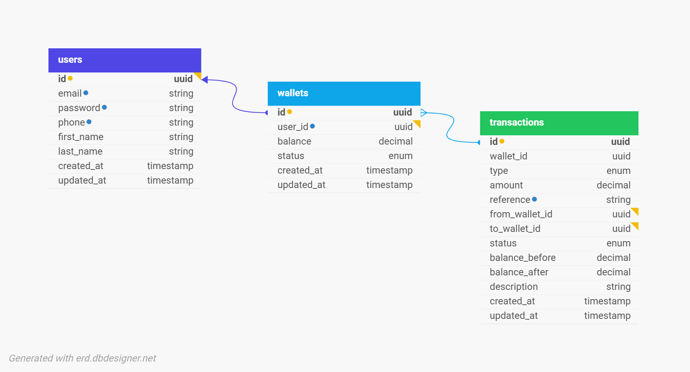

# Demo Credit Wallet Service

### A transaction-safe MVP wallet service built with NestJS, TypeScript, KnexJS, Jest, and MySQL.

The service allows users to:

* Create an account
* Automatically receive a wallet on signup
* Fund their wallet
* Transfer funds to another user
* Withdraw funds
* Prevent onboarding of blacklisted users using the Adjutor Karma API

The application was designed with financial consistency, transaction safety, and concurrency protection in mind.

---

# Tech Stack

* Node.js
* NestJS
* TypeScript
* KnexJS
* MySQL
* Jest
* Adjutor API

---

# Features

## User Features

* User registration
* Faux token authentication
* Karma blacklist validation using Adjutor API
* Automatic wallet creation on signup

## Wallet Features

* Fund wallet
* Transfer funds between wallets
* Withdraw funds
* Daily withdrawal limit validation
* Duplicate transaction reference protection

## Transaction Features

* Transaction logging
* Failed transaction logging
* Pending transaction states
* Transaction reference tracking

## Financial Safety Features

* Database transaction scoping
* Atomic balance updates
* Row locking using `FOR UPDATE`
* Rollback protection
* Concurrency-safe wallet updates

---

# Architecture Overview

The application follows a modular architecture:

```txt
src/
├── common/
│   └── database/
│       └──migrations/
|
├── lib/
│   └── integrations/
│       └── adjutor/
│
├── modules/
│   ├── users/
│   ├── wallet/
│   └── transactions/
│
└── test/
```

---

# Database Design

## E-R Diagram



---

# Database Tables

## users

Stores user account information.

| Column     | Type      |
| ---------- | --------- |
| id         | uuid      |
| first_name | varchar   |
| last_name  | varchar   |
| email      | varchar   |
| phone      | varchar   |
| password   | varchar   |
| created_at | timestamp |
| updated_at | timestamp |

---

## wallets

Stores wallet balances and wallet status.

| Column     | Type      |
| ---------- | --------- |
| id         | uuid      |
| user_id    | uuid      |
| balance    | decimal   |
| status     | enum      |
| created_at | timestamp |
| updated_at | timestamp |

---

## transactions

Stores all wallet transactions.

| Column              | Type      |
| ------------------- | --------- |
| id                  | uuid      |
| wallet_id           | uuid      |
| from_wallet_id      | uuid      |
| to_wallet_id        | uuid      |
| type                | enum      |
| amount              | decimal   |
| reference           | varchar   |
| description         | varchar   |
| balance_before      | varchar   |
| balance_after       | varchar   |
| status              | varchar   |
| created_at          | timestamp |
| updated_at          | timestamp |

---

# Transaction Safety Design

The wallet service was designed to ensure financial consistency.

## Transaction Scoping

All balance-changing operations are wrapped inside database transactions.

Example operations:

* wallet funding
* transfers
* withdrawals

This guarantees:

* atomic operations
* rollback protection
* prevention of partial updates

---

## Row Locking

Wallet rows are locked using pessimistic locking during update:

```sql
SELECT * FROM wallets
WHERE id = ?
FOR UPDATE;
```

This prevents:

* race conditions
* double spending
* concurrent balance corruption

---

## Failed Transaction Logging

Both successful and failed transactions are recorded.

Transaction statuses include:

* pending
* success
* failed

This improves:

* auditability
* debugging
* transaction traceability

---

# API Endpoints

## Base URL

All API requests should be sent to:

```txt
https://majeed-shuaib-lendsqr-be-test.onrender.com/v1
```

---

# Authentication

This API uses **Bearer Authentication** to secure protected endpoints.

Clients must include the access token in the `Authorization` header.

| Header        | Value                   |
| ------------- | ----------------------- |
| Authorization | `Bearer <access_token>` |

The access token is returned after a successful login request.

---

## Example Fund Wallet Request

```bash
curl -X POST "<BASE_URL>/wallet/fund" \
  -H "Authorization: Bearer <access_token>" \
  -H "Content-Type: application/json" \
  -H "Accept: application/json" \
  -d '{
    "userId": "string",
    "amount": 1000,
    "reference": "string"
  }'
```

---

# Available Endpoints

### Register user
```http
POST /users/register
```
Request Payload:
```json
{
  "firstName": "string",
  "lastName": "string",
  "email": "string",
  "password": "string",
  "phone": "string"
}
```
Response:
```josn
{
  "message": "string",
  "data": {
    "id": "string",
    "first_name": "string",
    "last_name": "string",
    "email": "string",
    "phone": "string"
  }
}
```

---

### Login
```http
POST /users/login
```

Request Payload:
```json
{
  "email": "string",
  "password": "string"
}
```

Response:
```json
{
  "message": "string",
  "data": {
    "id": "string",
    "token": "string"
  }
}
```

---

### Fund Wallet
```http
POST /wallet/fund
```

Request Payload:
```json
{
  "userId": "string",
  "amount": "number",
  "reference": "string"
}
```

Response:
```json
{
  "message": "string",
  "balance": "number"
}
```

---

### Transfer Funds
```http
POST /wallet/transfer
```

### Request
Request Payload:
```json
{
  "amount": "number",
  "receiverUserId": "string",
  "senderUserId": "string"
}
```

Response:
```json
{
  "message": "string",
  "balance": "number"
}
```

----

### Withdraw Funds
```http
POST /wallet/withdraw
```

Request Payload:
```json
{
  "amount": "number",
  "userId": "string",
  "reference": "string"
}
```

Response:
```json
{
  "message": "string",
  "balance": "number"
}
```

---

# Error Responses

| Status Code               | Description                                          |
| --------------------------| ---------------------------------------------------- |
| 400 Unauthorized          | Invalid request payload                              |
| 401 Unauthorized          | Missing authorization token                          |
| 404 Not Found             | Resource not found                                   |
| 409 Duplicate             | Resource already exist                               |
| 500 Internal Server Error | Unexpected server error                              |

---

# Setup Instructions

## Clone Repository

```bash
git clone https://github.com/jidsfotech/DemoCredit-Wallet-Service.git
```

---

## Install Dependencies

```bash
yarn install
```

---

## Environment Variables

Create:

```txt
.env
```

Example:

```env
PORT=

DB_HOST=
DB_PORT=
DB_USER=
DB_PASSWORD=
DB_NAME=

# Faux token for authentication
JWT_TOKEN=

ADJUTOR_API_ID= 
ADJUTOR_API_KEY= 
ADJUTOR_BASE_URL=
```

---

# Run Migrations

```bash
yarn run migrations
```

---

# Start Application

## Development

```bash
yarn start:dev
```

## Production

```bash
yarn build
yarn start:prod
```

---

# Running Tests

## Unit Tests

```bash
yarn test
```

## E2E Tests

```bash
yarn test:e2e
```

---

# Testing Strategy

The application includes unit tests for:

* user registration
* wallet funding
* wallet transfer
* wallet withdrawal
* failed transaction scenarios
* rollback scenarios
* insufficient balance scenarios
* duplicate transaction protection

Mocks were used to isolate:

* repositories
* external APIs
* database transactions

---

# Author

Majeed Shuaib